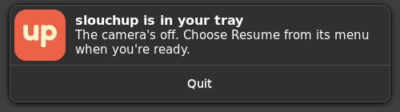

# SlouchUp

SlouchUp nudges you the moment you start slouching, so the habit gets caught while it's forming
rather than at the end of the day.

It learns where your eyes sit and how big your face looks when you're sitting well, then nudges
you when your eyes sink or your face grows as you lean towards the screen. Everything runs on your
computer. Video never leaves it.

| Sitting well | Slouching | Leaning in |
|---|---|---|
|  |  |  |

The person in the screenshots is drawn, not filmed: `--demo` swaps the webcam for an illustrated
stand-in who sits up, sinks and leans in, while detection runs on it for real.

## Using it

SlouchUp lives in the system tray as the word "up" in a frame. The letters sink as you do, and
once you pass your slouch limit, marked by notches on the frame, they turn over to read "dn". They
turn dotted when you're out of frame, and grey while you've paused. Clicking it opens a popover
showing whether SlouchUp is on and how you're sitting, with:

- **SlouchUp**, the wordmark at the top — opens SlouchUp's window, on your camera with the
  baseline and slouch lines, and how close each measure is to its limit. Its header switches
  between the Camera, History and Settings views. On the picture's bottom strip, as on a video call, are Pause, which offers the
  same choices as the popover's; with more than one camera, a button listing them; and Calibrate,
  offering a quick calibration or the guided, full-screen one.
- **Pause** — for 30 minutes, for 1 hour or until you resume. The camera turns off, say for a
  call, and comes back on by itself when the time is up. While paused, **Resume** takes its place.
  The nudge has a Pause 30 min button too, and the time paused is left out of your history.
- **Calibrate** — **Quick** is three seconds of sitting nicely, with a notification to say when,
  so it works with the window closed. **Guided, full screen** walks you through sitting up while
  looking at each of your screens, slouching, and leaning in, then sets the limits halfway between.
- **Camera**, **History** and **Settings** — open the window on that view. History shows how
  you've sat today, quarter hour by quarter hour, and how much of each of the last seven days you
  spent slouching. Settings has how soon to nudge, how sensitive it is compared with your
  calibration, and whether to keep history, each section with its finer controls in an expandable
  at its end.
- **Quit SlouchUp**, which is also at the bottom of Settings.

On a panel that never passes on clicks to the tray icon, starting SlouchUp again opens its window.

The first time it starts, a welcome asks before turning the camera on, lets you pick which camera,
and shows the icon to look for in the tray. Turning the camera on starts the guided calibration.


Closing the window leaves SlouchUp running in the tray. The first close of each run says so
in a small window with Keep running and Quit buttons, and in a notification.


When the camera is off, after Not now on the welcome or while paused, a notification says so
instead, with Resume in the tray's popover to turn it on.




### History

The History view charts how you've sat: sitting well, slouching and away for each
quarter hour of today, then the share of each of the last seven days spent slouching. It keeps
two weeks, readable only by you, and saves every ten minutes and when you pause or quit. Settings
can turn it off or clear it. The screenshot is the demo's made-up week.


### Guided calibration

Each step fills a screen: sit up looking at each of your screens in turn, then slouch down, sit
up, and slouch forward. The first time, each kind of step is taught as it comes, with a drawing
and one line, until you press Next. Then the step says what to do and waits until you're in the
pose, or until you press Next, then hides its words and measures while a ring fills round the
eyes. A small view of your camera sits at the top, centred, near where a laptop's camera is.
SlouchUp then sets its limits halfway between how you sit and how you slouch, and shows them,
with Do it again in case a step went wrong. Stop, or Esc, ends it at any point and keeps the
calibration from before.


The baseline also follows you slowly: it catches up within minutes when you sit better than it,
but only over half an hour when you sit worse, so gradual slouching isn't quietly accepted.
Tilting a laptop lid is told apart from slouching by how the background moves.

```sh
cargo build --release
target/release/slouchup            # tray only
target/release/slouchup --show     # with the window open on the camera
target/release/slouchup --demo     # with the drawn stand-in instead of a webcam
target/release/slouchup --settings # with the window open on Settings
target/release/slouchup --history  # with the window open on History
```

The limits are saved in `~/.config/slouchup/thresholds.json`, other settings in
`~/.config/slouchup/settings.json`, each guided calibration's recording in
`~/.cache/slouchup/games/`, and the history in `~/.cache/slouchup/history.json`. On Windows they
are all in `%LOCALAPPDATA%\We Are Frames\slouchup`. Settings from before the rename, in
`~/.config/slouch`, are copied over on first run.

## Platforms

SlouchUp runs on Linux, macOS and Windows, and CI builds and tests it on all three.

Every push to `main` packages it for each platform, and a `v*` tag publishes the packages as a
[release](https://github.com/Jamedjo/slouchup/releases). `scripts/release.sh` raises the version
for a release, and once that's merged, pushes its tag; [RELEASE.md](RELEASE.md) has the steps.
The packages are:

- Linux: `slouchup-x86_64.AppImage`, from `packaging/linux/appimage.sh` with Velopack. It looks
  for a newer release every few hours, downloads it in the background, and replaces itself with it
  when you quit, or else the next time it starts. It adds itself to the app launcher the first time
  it runs, unless AppImageLauncher or Gear Lever has added it already. Removing it from your
  launcher is respected.
- Mac: `slouchup-mac.dmg`, holding `SlouchUp.app` for Apple silicon and Intel, from
  `packaging/macos/bundle.sh`. macOS only grants camera access to an app bundle.
- Windows: `slouchup-setup.exe`, from `packaging/windows/setup.ps1` with
  [Velopack](https://velopack.io). It installs for you alone, without questions or an
  administrator, into `%LOCALAPPDATA%\slouchup`, and adds SlouchUp to the Start menu and to
  Apps & features. Uninstalling keeps your settings, so a reinstall picks them up. Once
  installed, SlouchUp looks for a newer release every few hours, downloads it in the background,
  and installs it when you quit, or else the next time it starts.

The packages aren't signed, so macOS and Windows warn before opening them the first time.

## How it's built

A Rust workspace, with the parts that could be useful elsewhere in their own crates:

| Crate | What it does |
|---|---|
| [`yunet`](crates/yunet) | YuNet face detection with five landmarks, in pure Rust on [tract](https://github.com/sonos/tract) |
| [`camera-drift`](crates/camera-drift) | How far a webcam has tilted, from the background around a person |
| [`posture`](crates/posture) | Slouch decisions, nag timing and calibration scoring, with no camera or UI |
| [`tray-popover`](crates/tray-popover) | Where a popover goes by a tray icon, and when it opens or closes, with no windowing library |
| [`tray-popover-tao`](crates/tray-popover-tao) | That popover in a [tao](https://github.com/tauri-apps/tao) window, as a panel on macOS |
| [`slouch-app`](crates/slouch-app) | The [Dioxus](https://dioxuslabs.com) app: tray, notifications, window and guided calibration |

The camera preview reaches the window through Dioxus's in-process protocol rather than a local
server, so no other program or web page can read the camera through SlouchUp.
`vendor/tract-core` carries vectorised kernels that make face detection about four times faster on
x86; it goes once tract ships its own.

The face model is [YuNet](https://github.com/opencv/opencv_zoo/tree/main/models/face_detection_yunet)
from the OpenCV model zoo (MIT). The camera preview script comes from
[dioxus-cameras](https://github.com/matthewjberger/cameras). The typefaces are
[Fredoka](https://github.com/hafontia/Fredoka-One) and [Figtree](https://github.com/erikdkennedy/figtree)
(SIL Open Font License, in [`crates/slouch-app/fonts`](crates/slouch-app/fonts)), built in so the
app never fetches fonts.

[DEVELOPMENT.md](DEVELOPMENT.md) covers building, testing and packaging.

To refresh the screenshots, run `scripts/screenshots.sh`; it uses a headless sway session, so it
doesn't touch your desktop.

The first version was a Python experiment, kept on the `python` branch.

The website in `www/` is an [Astro](https://astro.build) site, published from `main` to GitHub Pages
at [slouchup.com](https://slouchup.com). Run `npm install` and `npm run dev` there to work on it.


Links to it unfurl with this card, drawn at build time by `www/src/brand/card.ts`:


