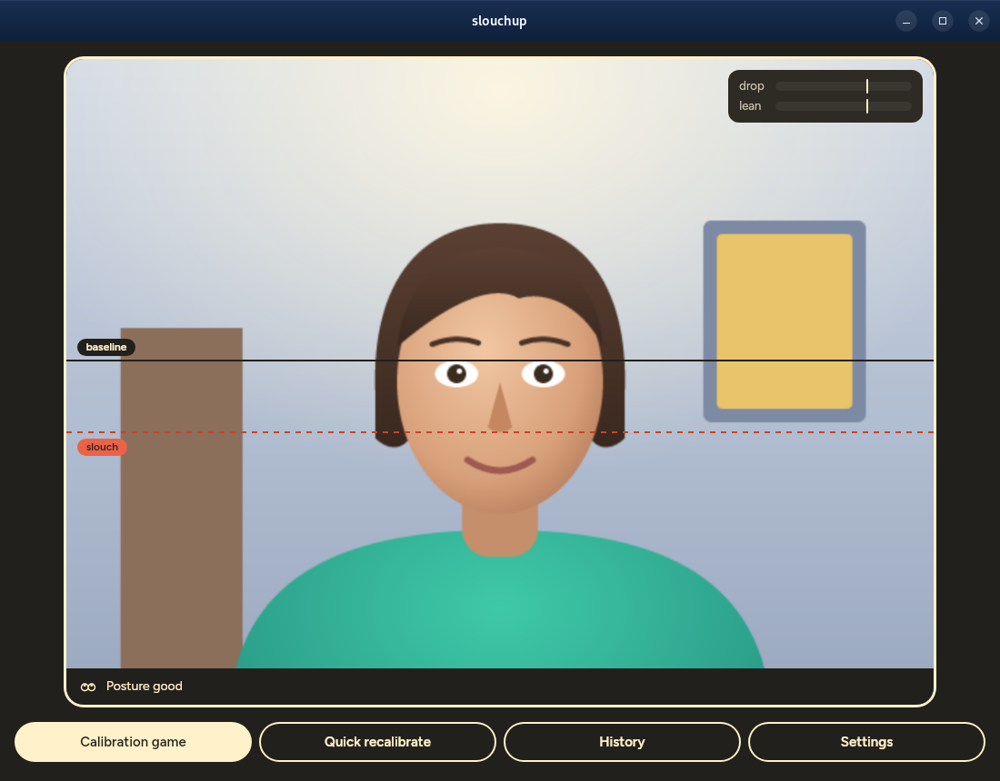
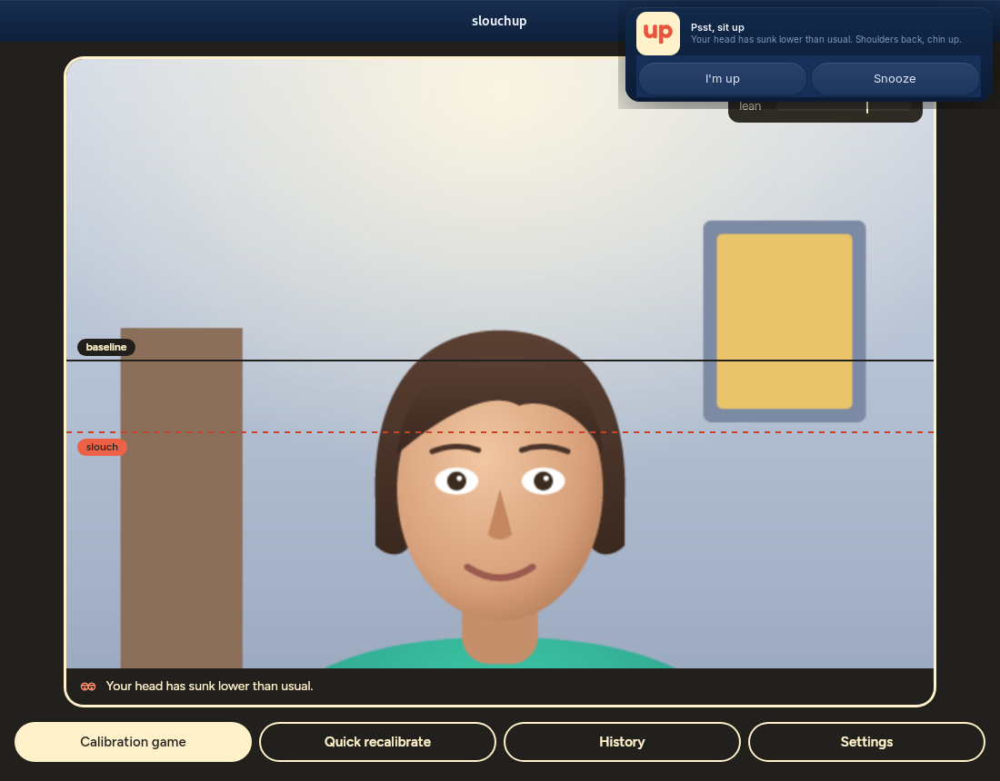
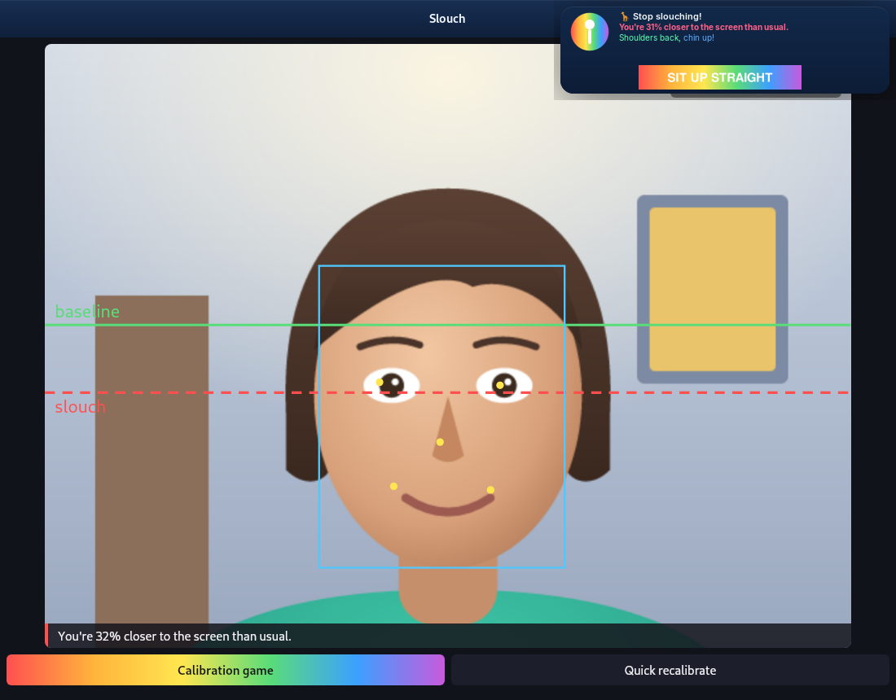
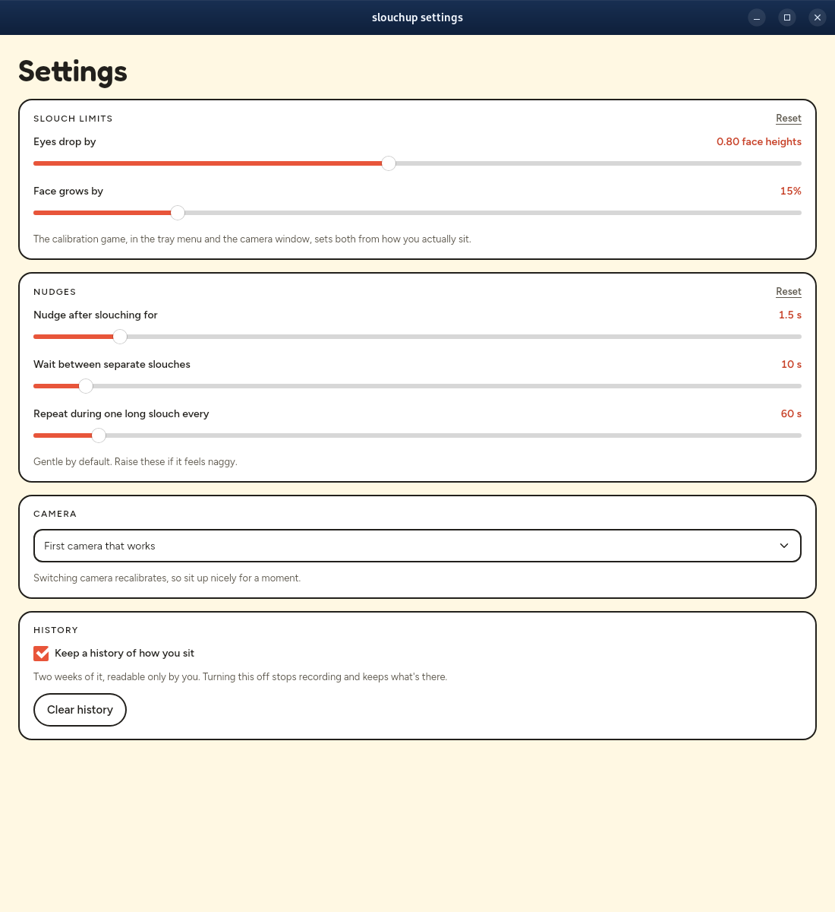
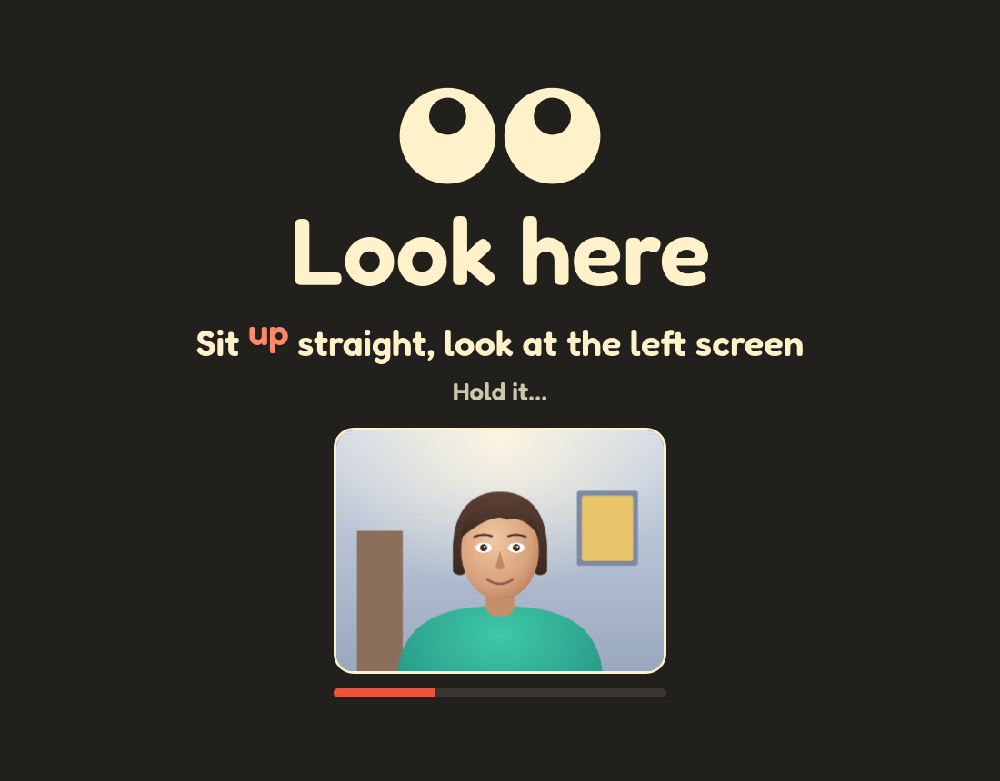

# slouchup

slouchup watches your webcam and nudges you the moment you start slouching, so the habit gets caught
while it's forming rather than at the end of the day.

It finds your face, notes where your eyes sit and how big your face looks when you're sitting
well, then nags when your eyes sink or your face grows as you lean towards the screen.
Everything runs on your computer; no frame leaves it.

| Sitting well | Slouching | Leaning in |
|---|---|---|
|  |  |  |

The person in the screenshots is drawn, not filmed: `--demo` swaps the webcam for an illustrated
stand-in who sits up, sinks and leans in, while detection runs on it for real.

## Using it

slouchup lives in the system tray as a pair of eyes: they look up while you sit well, drop their
lids while you slouch, and close when they can't see you or you've paused them. Its menu shows the
current status and has:

- **Show camera** — your camera with the baseline and slouch lines, and how close each measure is
  to its limit.
- **Calibration game** — full-screen prompts walk you through sitting up while looking at each of
  your screens, slouching, and leaning in, then set the limits halfway between. It runs by itself
  the first time slouchup starts.
- **Recalibrate** — three seconds of sitting nicely sets a new baseline.
- **Settings** — which camera to use, the two slouch limits, and how soon and how often to nag.
- **Snooze for 30 minutes** — no nudges for a while, though it keeps watching. On Linux and macOS
  the nudge itself has a Snooze button too.
- **Pause** and **Quit**.



### Calibration game

Each step fills a screen: sit up looking at each of your screens in turn, then slouch, sit up,
and lean in, with a small view of your camera to check you're in frame. slouchup then sets its
limits halfway between how you sit and how you slouch.



The baseline also follows you slowly: it catches up within minutes when you sit better than it,
but only over half an hour when you sit worse, so gradual slouching isn't quietly accepted.
Tilting a laptop lid is told apart from slouching by watching the background move.

```sh
cargo build --release
target/release/slouch            # tray only
target/release/slouch --show     # with the camera window open
target/release/slouch --demo     # with the drawn stand-in instead of a webcam
target/release/slouch --settings # with the settings window open
```

The limits are saved in `~/.config/slouchup/thresholds.json`, other settings in
`~/.config/slouchup/settings.json`, and each calibration game's recording in
`~/.cache/slouchup/games/`. Settings from before the rename, in `~/.config/slouch`, are copied over
on first run.

## Platforms

Linux is where slouchup is developed and used. CI builds and tests it on macOS and Windows too, but
it hasn't been run as an app there yet. `packaging/macos/bundle.sh` makes an app bundle, which macOS
needs before it allows camera access.

## How it's built

A Rust workspace, with the parts that could be useful elsewhere in their own crates:

| Crate | What it does |
|---|---|
| [`yunet`](crates/yunet) | YuNet face detection with five landmarks, in pure Rust on [tract](https://github.com/sonos/tract) |
| [`camera-drift`](crates/camera-drift) | How far a webcam has tilted, from the background around a person |
| [`posture`](crates/posture) | Slouch decisions, nag timing and calibration game scoring, with no camera or UI |
| [`slouch-app`](crates/slouch-app) | The [Dioxus](https://dioxuslabs.com) app: tray, notifications, camera window and game |

The camera preview reaches the window through Dioxus's in-process protocol rather than a local
server, so no other program or web page can read the camera through slouchup.
`vendor/tract-core` carries vectorised kernels that make face detection about four times faster on
x86; it goes once tract ships its own.

The face model is [YuNet](https://github.com/opencv/opencv_zoo/tree/main/models/face_detection_yunet)
from the OpenCV model zoo (MIT). The camera preview script comes from
[dioxus-cameras](https://github.com/matthewjberger/cameras). The typefaces are
[Fredoka](https://github.com/hafontia/Fredoka-One) and [Figtree](https://github.com/erikdkennedy/figtree)
(SIL Open Font License, in [`crates/slouch-app/fonts`](crates/slouch-app/fonts)), built in so the
app never fetches fonts.

To refresh the screenshots, run `scripts/screenshots.sh`; it uses a headless sway session, so it
doesn't touch your desktop.

The first version was a Python experiment, kept on the `python` branch.
