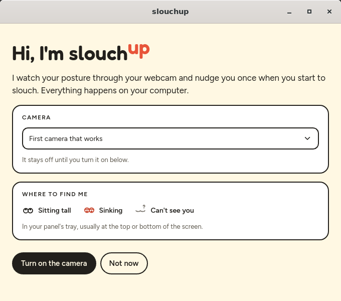
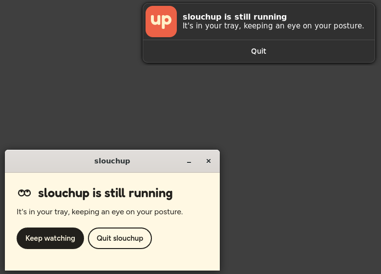
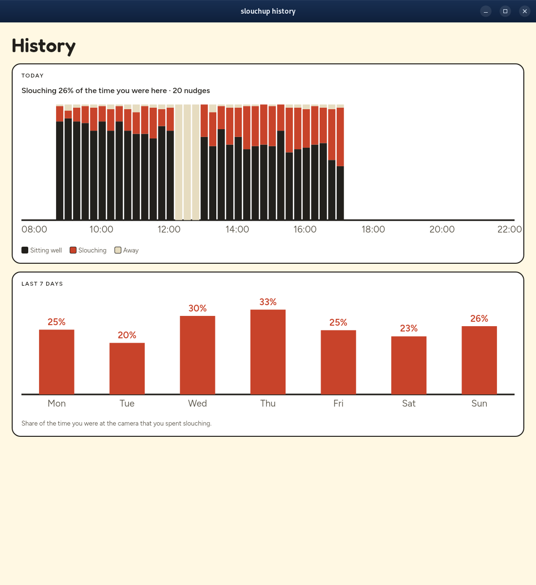
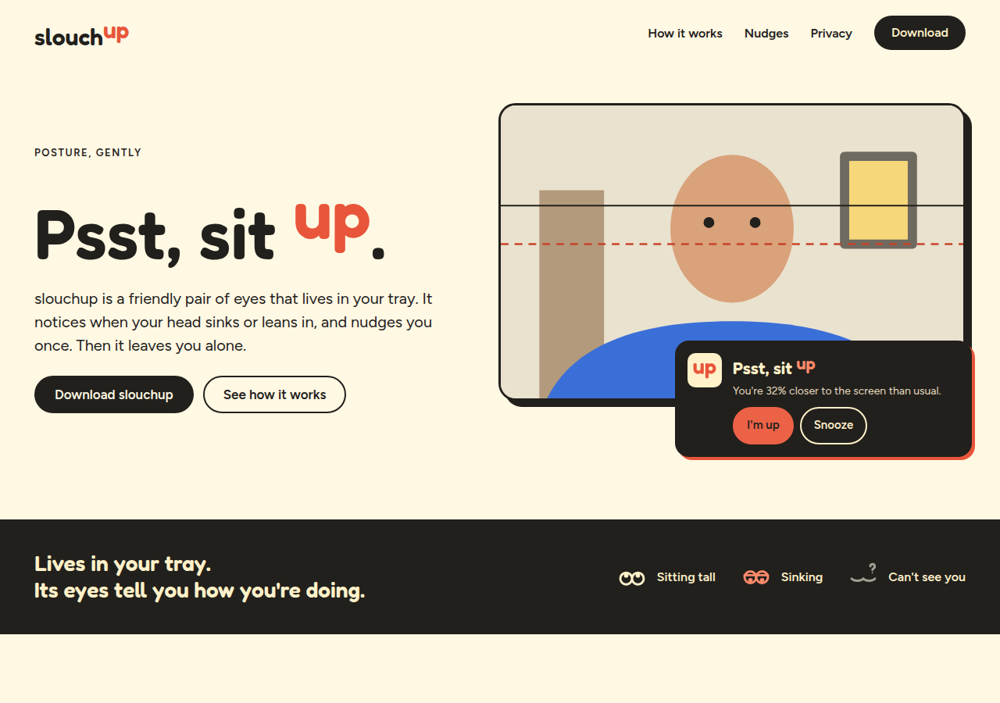
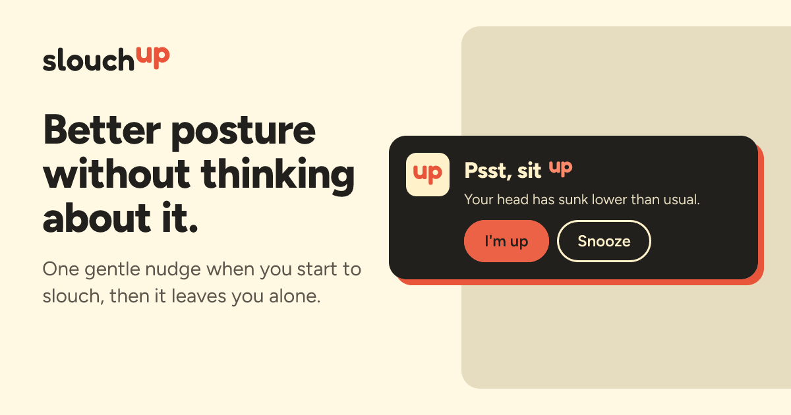

# slouchup

slouchup watches your webcam and nudges you the moment you start slouching, so the habit gets caught
while it's forming rather than at the end of the day.

It finds your face, notes where your eyes sit and how big your face looks when you're sitting
well, then nags when your eyes sink or your face grows as you lean towards the screen.
Everything runs on your computer; no frame leaves it.

| Sitting well | Slouching | Leaning in |
|---|---|---|
|  |  |  |

The person in the screenshots is drawn, not filmed: `--demo` swaps the webcam for an illustrated
stand-in who sits up, sinks and leans in, while detection runs on it for real.

## Using it

slouchup lives in the system tray as a pair of eyes: they look up while you sit well, drop their
lids while you slouch, and close when they can't see you or you've paused them. Its menu shows the
current status and has:

- **Show camera** — your camera with the baseline and slouch lines, and how close each measure is
  to its limit.
- **Calibration game** — full-screen prompts walk you through sitting up while looking at each of
  your screens, slouching, and leaning in, then set the limits halfway between.
- **Recalibrate** — three seconds of sitting nicely sets a new baseline.
- **History** — how you've sat today, quarter hour by quarter hour, and how much of each of the
  last seven days you spent slouching.
- **Settings** — which camera to use, the two slouch limits, and how soon and how often to nag.
- **Snooze for 30 minutes** — no nudges for a while, though it keeps watching. The nudge itself
  has a Snooze button too.
- **Pause** and **Quit**.

The first time it starts, a welcome asks before turning the camera on, lets you pick which camera,
and shows the eyes to look for in the tray. Turning the camera on starts the calibration game.



Closing the camera window leaves slouchup running in the tray. The first close of each run says so
in a small window with Keep watching and Quit buttons, and in a notification.




### History

The history window charts what slouchup has seen: sitting well, slouching and away for each
quarter hour of today, then the share of each of the last seven days spent slouching. It keeps
two weeks, readable only by you, and saves every ten minutes and when you pause or quit. Settings
can turn it off or clear it. The screenshot is the demo's made-up week.



### Calibration game

Each step fills a screen: sit up looking at each of your screens in turn, then slouch, sit up,
and lean in, with a small view of your camera to check you're in frame. slouchup then sets its
limits halfway between how you sit and how you slouch.


The baseline also follows you slowly: it catches up within minutes when you sit better than it,
but only over half an hour when you sit worse, so gradual slouching isn't quietly accepted.
Tilting a laptop lid is told apart from slouching by watching the background move.

```sh
cargo build --release
target/release/slouchup            # tray only
target/release/slouchup --show     # with the camera window open
target/release/slouchup --demo     # with the drawn stand-in instead of a webcam
target/release/slouchup --settings # with the settings window open
target/release/slouchup --history  # with the history window open
```

The limits are saved in `~/.config/slouchup/thresholds.json`, other settings in
`~/.config/slouchup/settings.json`, each calibration game's recording in
`~/.cache/slouchup/games/`, and the history in `~/.cache/slouchup/history.json`. Settings from before the rename, in `~/.config/slouch`, are copied over
on first run.

## Platforms

slouchup is developed on Linux and has been run on Windows. CI builds and tests it on macOS too,
but it hasn't been run as an app there yet.

Every push to `main` packages it for each platform, and a `v*` tag publishes the packages as a
[release](https://github.com/Jamedjo/slouchup/releases):

- Linux: `slouchup-linux.AppImage`, from `packaging/linux/appimage.sh`
- Mac: `slouchup-mac.dmg`, holding `slouchup.app` for Apple silicon and Intel, from
  `packaging/macos/bundle.sh`. macOS only grants camera access to an app bundle.
- Windows: `slouchup-windows.zip`, holding `slouchup.exe`, from `packaging/windows/zip.ps1`

The packages aren't signed, so macOS and Windows warn before opening them the first time.

## How it's built

A Rust workspace, with the parts that could be useful elsewhere in their own crates:

| Crate | What it does |
|---|---|
| [`yunet`](crates/yunet) | YuNet face detection with five landmarks, in pure Rust on [tract](https://github.com/sonos/tract) |
| [`camera-drift`](crates/camera-drift) | How far a webcam has tilted, from the background around a person |
| [`posture`](crates/posture) | Slouch decisions, nag timing and calibration game scoring, with no camera or UI |
| [`slouch-app`](crates/slouch-app) | The [Dioxus](https://dioxuslabs.com) app: tray, notifications, camera window and game |

The camera preview reaches the window through Dioxus's in-process protocol rather than a local
server, so no other program or web page can read the camera through slouchup.
`vendor/tract-core` carries vectorised kernels that make face detection about four times faster on
x86; it goes once tract ships its own.

The face model is [YuNet](https://github.com/opencv/opencv_zoo/tree/main/models/face_detection_yunet)
from the OpenCV model zoo (MIT). The camera preview script comes from
[dioxus-cameras](https://github.com/matthewjberger/cameras). The typefaces are
[Fredoka](https://github.com/hafontia/Fredoka-One) and [Figtree](https://github.com/erikdkennedy/figtree)
(SIL Open Font License, in [`crates/slouch-app/fonts`](crates/slouch-app/fonts)), built in so the
app never fetches fonts.

To refresh the screenshots, run `scripts/screenshots.sh`; it uses a headless sway session, so it
doesn't touch your desktop.

The first version was a Python experiment, kept on the `python` branch.

The website in `www/` is an [Astro](https://astro.build) site, published from `main` to GitHub Pages
at [slouchup.com](https://slouchup.com). Run `npm install` and `npm run dev` there to work on it.



Links to it unfurl with this card, drawn at build time by `www/src/brand/card.ts`:


